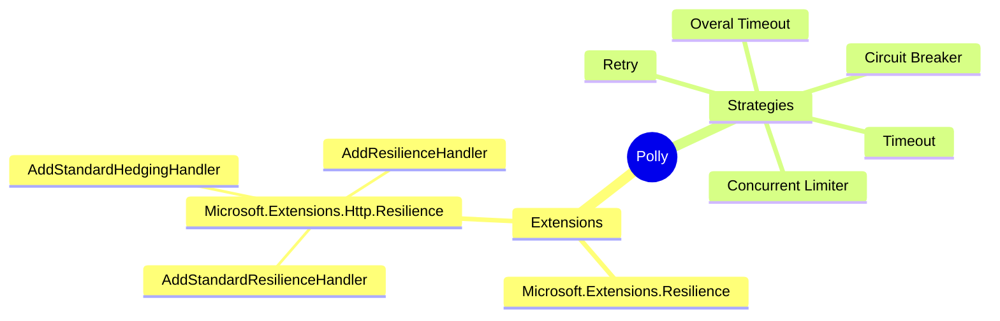

# Polly 

- [Content index](../README.md)
- [AppBuilders](./AppBuilders.md)
- [Libraries used in the sample](./UsedLibs.md)

## Creation using Pipeline - Specific pipeline

We use  **ResiliancePipeline** to create an instance that will help use execute any (async, sync) or even something that returns void, and with the builder instance we can apply as many strategies as you needed

``` 

ResiliencePipeline newInstance = new ResiliencePipelineBuilder()
    .AddRetry(new RetryStrategyOptions
    {
        MaxRetryAttempts = 4,
        BackoffType = DelayBackoffType.Exponential,
        UseJitter = true
    })
    .AddTimeout(TimeSpan.FromSeconds(3))
    .Build();

```

You use the new instance to execute any callback.

```
await newInstance.ExecutreAsync(
    async token => 
    {
        // you can put your code logic here
    }, cancellationToken);
```

## For Non-Specific generic pipelines, use generic pipeline

You add ``` ResilencePipeline<Type> ``` to specify which will be your strategy and which type of callbacks will be handled.

``` 
ResiliencePipeline<HttpResponseMessage> httpInstancePipe = new ResiliencePipelineBuilder<HttpResponseMessage>()
    .AddRetry(new RetryStrategyOptions<HttpResonseMessage>
    {
        ShouldHandle = new PredicateBuilder<HttpResonseMessage>().
            .Handle<HttpResonseMessage>()
            .HandleResult(response => response.StatusCode => HttpStatusCode.InternalServerError)
        MaxRetryAttempts = 4,
        BackoffType = DelayBackoffType.Exponential,
        UseJitter = true
    })
    .AddTimeout(TimeSpan.FromSeconds(3))
    .Build();
```

And the you could use the pipe for all your http calls.


```
await httpInstancePipe.ExecutreAsync(
    async token => await httpClient.GetAsync("/some-path"), cancellationToken);
```



## Http polly resilience libraries

```Microsoft.Extensions.Http.Resilience``` is an API for building and using HTTP resilience pipelines.

- Custom pipelines
- Standrard pipelines
- Standar hedging pipeline

### Implementation AddResilienceHandler

Once ```Microsoft.Extensions.Http.Resilience``` is added as package then you need to call the method extension ```AddResilienceHandler``` after you call ```AddHttpClient``` method.

```AddResilienceHandler``` recieves 2 parameters

* String identifier used for telemetry purpose 
* A callback to configure your strategies

### Strategies configuration

#### 1. Timeout for long request
```builder.AddTimeout(TimeSpan.FromSeconds(1))```: Limit the latency of requests, to reject long requests to preserve client and server resources. This configuration says that I don't want my requests take longer than 1 second, this throw a timeout exception

#### 2. Retry unsuccessful requests

```
builder.AddRetry(new HttpRetryStrategyOptions
{
    MaxRetryAttempts = 5,
    BackoffType = DelayBackoffType.Exponential, 
    UseJitter = true, 
    Delay = TimeSpan.Zero
});
```

* **HttpRetryStrategyOptions:** Inherit from RetryStrategyOptions so this are pollyV8 options and tailor for http scenarios.
* **MaxRetryAttempts:** How many retries we want to do.
* **BackoffType:** Strategy waits between the retries. 
* **UseJitter:** Introduce randomness into retry intervals, it helps prevent multiple concurrent operations from synchronizing their retries, which can occur if all operations encounter the same transient fault and retry at the same time.
* **Delay:** Change base delay that we use for the retries


#### 3. Circuit breaker

Circuit breaker is able to detect outage in the remote service and is able to suspend all your communication to that endpoint and re-establish the communication. For a period of time it can try again and see if the issue is resolved. If you want to fine-tune your circuit breaker you need to understand the next concepts.

``` 
builder.AddCircuitBreaker(new HttpCircuitBreakerStrategyOptions 
{
    SamplingDuration = TimeSpan.FromSeconds(5),
    FailureRatio = 0.9,
    MinimumThroughput = 5,
    BreakDuration = TimeSpan.FromSeconds(5)
});
```

* **HttpCircuitBreakerStrategyOptions:** Inherit from CircuitBreakerStrategyOptions so this are pollyV8 options and tailor for http scenarios.
* **SamplingDuration:** Time that is taken to evaluate
* **FailureRatio:** Percentage of error occurred
* **MinimumThroughput:** Minimum amount of errors
* **BreakDuration:** Circuit Breaker duration

_**Explanation for the configuration above:** over the sampling duration of five seconds if you have a minimum throughput of requests of 5, and 90% of those requests are no successful then the circuit breaker will open (open circuit breaker means that there is no communication flowing out of the http client), and that circuit breaker will be open for a duration of 5 seconds, after that 5 seconds, circuit breaker will allow us 1 single request that is called probing request and if that request is successful then the circuit breaker is closed and the communication can flow again._

#### 4. Overal Timeout 

```builder.AddTimeout(TimeSpan.FromSeconds(5))```: This timeout applies across all the attempts, including all the attempts we don't want our request take more than 1 specific time.

#### 5. Concurrent Limiter

```builder.AddConcurrencyLimiter(100)```: This is used to prevent DDOS attacks we add rate limiting by limiting the amount of concurrent requests that can flow at any given point in time.

### Implementation AddStandardResilienceHandler()

This implementation automatically incorporate the previous five strategies, there are some defaults that you can use as it is, unless you want to fine-tune the behavior, If you want to fine-tune the behavior you can call the method ```Configure(options => { })``` from ```AddStandardResilenceHandler()``` and change the options 

Example:

```
.AddStandardResilienceHandler()
    .Configure(options => 
    {
        options.TotalRequestTimeout.Timeout = TimeSpan.FromMicroseconds(10);
        
        options.Retry.MaxRetryAttempts = 5;
        options.Retry.Delay = TimeSpan.Zero;

        options.CircuitBreaker.SamplingDuration = TimeSpan.FromSeconds(5);
        options.CircuitBreaker.MinimumThroughput = 5;
        options.CircuitBreaker.FailureRatio = 0.9;
        options.CircuitBreaker.BreakDuration = TimeSpan.FromSeconds(1);

        options.AttemptTimeout.Timeout = TimeSpan.FromSeconds(1);
    });
```

### Implementation AddStandardHedgingHandler()

```AddStandardHedgingHandler()``` is normally use to rid off all slow requests by doing retries in parallel and it will used the first faster of them.

This is recommended for important request that do not change the state of the server because you could get into corrupted data

```
.AddStandardHedgingHandler()
    .Configure(options => 
    {
        options.TotalRequestTimeout.Timeout = TimeSpan.FromSeconds(10);
        
        options.Hedging.MaxHedgedAttempts = 5;
        options.Hedging.Delay = TimeSpan.FromMilliseconds(50);

        options.Endpoint.CircuitBreaker.SamplingDuration = TimeSpan.FromSeconds(5);
        options.Endpoint.CircuitBreaker.MinimumThroughput = 5;
        options.Endpoint.CircuitBreaker.FailureRatio = 0.9;
        options.Endpoint.CircuitBreaker.BreakDuration = TimeSpan.FromSeconds(5);

        options.Endpoint.Timeout.Timeout = TimeSpan.FromSeconds(1);
    });
```

#### Difference 

Using Hedging the delay is used to define the amount of time to trigger a parallel request in case the current is taking more than the specified time.

Also, if you want to set up the Circuit Breaker you’er going to need to add ```Endpoint``` word before.

### Other Extension

```Microsoft.Extensions.Resilience``` is a thin library that enriches the built-in Telemetry of poly
